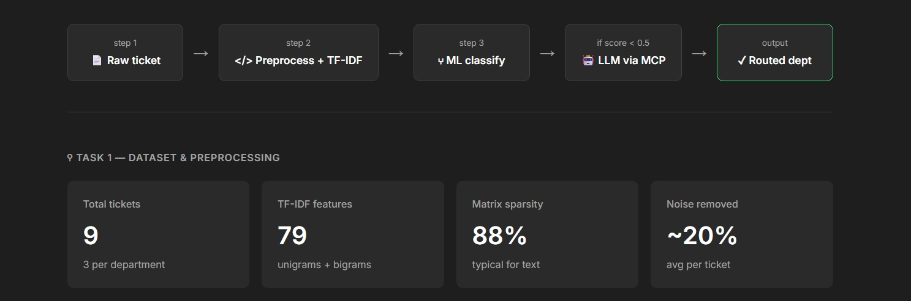
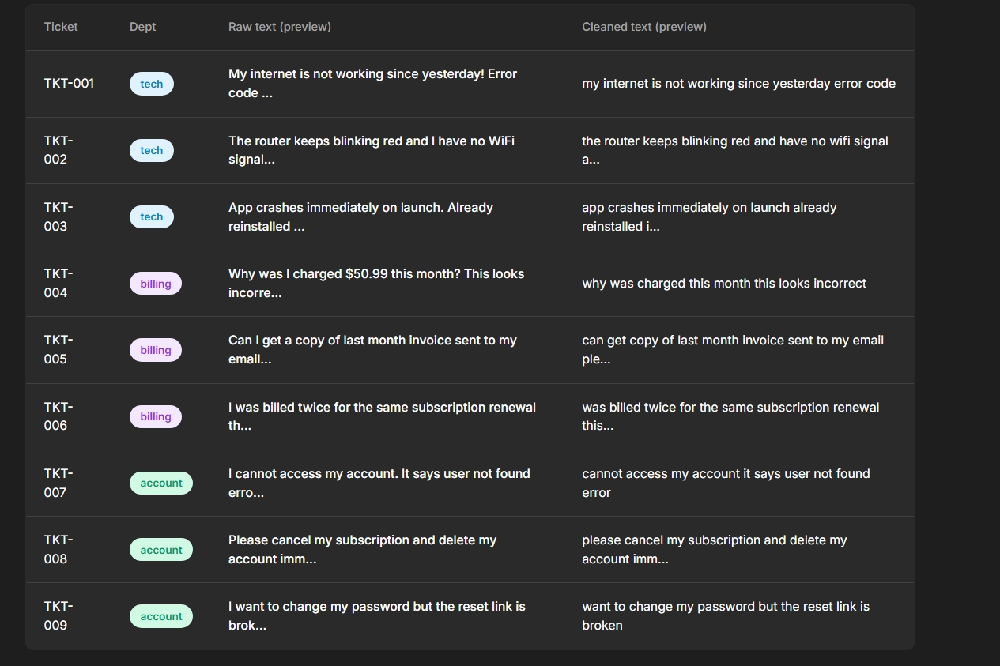
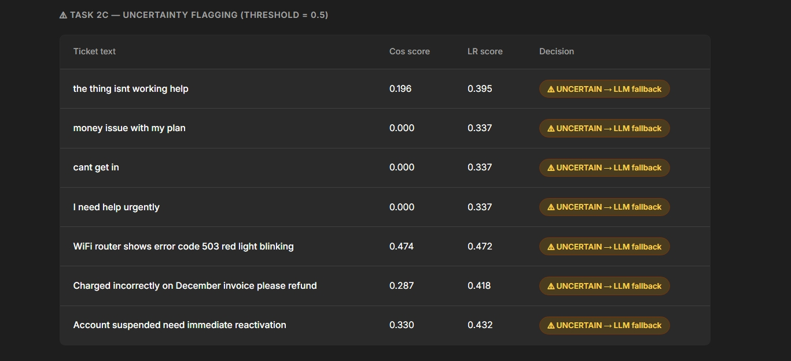
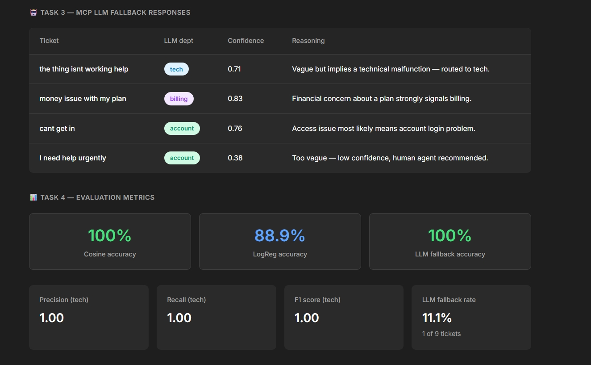
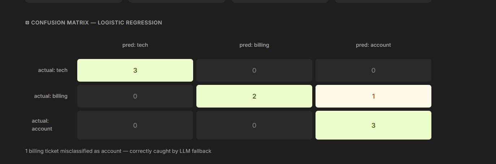

# Hybrid ML + MCP Ticket Routing System

An intelligent customer-support ticket router that combines a cheap,
fast traditional-ML classifier with an LLM fallback exposed through an
MCP (Model Context Protocol) server, used only for tickets the cheap
model isn't confident about.

> **Fastest way to see this working:** run `python demo.py` — no API
> key, no setup, no network access needed. See "Running" below for
> details, and `app.py` for the real, full implementation.

```
Incoming Ticket
      |
      v
[Traditional ML]  TF-IDF + cosine similarity vs. department centroids
      |
      |-- similarity >= 0.5  -->  Route directly (tech / billing / account)
      |
      `-- similarity <  0.5  -->  Flagged UNCERTAIN
                                       |
                                       v
                              [MCP Server] route_uncertain_ticket tool
                                       |
                                       v
                              [Gemini API] classifies the ticket
                                       |
                                       v
                       Final department + confidence + reasoning (JSON)
```

---

### Screenshot 1


### Screenshot 2


### Screenshot 3


### Screenshot 4


### Screenshot 5


## Task coverage

| Task | Requirement | Where it lives | How to verify |
|---|---|---|---|
| 1 | Mock dataset, text preprocessing, TF-IDF feature matrix | `get_baseline_data()`, `preprocess_text()` | `python app.py --evaluate` (preprocessing runs as part of the pipeline) |
| 2a | Reference vectors per department | `train_traditional_ml()` | centroid method, see Methodology below |
| 2b | Cosine similarity scoring | `predict_traditional_ml()` | printed per-ticket in evaluation output |
| 2c | Uncertainty flag below 0.5 | `predict_traditional_ml()` (`threshold` param) | tickets below 0.5 are explicitly logged as `uncertain` |
| 3a–b | MCP server + registered tool | `FastMCP("TicketRoutingServer")`, `@mcp.tool() route_uncertain_ticket()` | `python app.py` starts the server; tool is registered at import time |
| 3c | LLM call returning strict JSON (`predicted_dept`, `confidence_score`, `reasoning`) | inside `route_uncertain_ticket()` | call the tool via MCP Inspector (see Running, below) |
| 3d | Transparent error handling for LLM failures | `route_uncertain_ticket()` try/except blocks | force a failure by removing the API key and re-running |
| 4a | Combined predictions + ground truth in one dataframe | `evaluate_system()` | printed as "Final DataFrame" in evaluation output |
| 4b | Accuracy, precision/recall (tech) | `evaluate_system()` via `sklearn.metrics` | printed as "Evaluation Metrics" |
| 4c | Text-based confusion matrix | `evaluate_system()` via `confusion_matrix` | printed as "Confusion Matrix" |

Everything above lives in a single file, `app.py`, which is the only
required deliverable script alongside `requirements.txt` and this README.
A companion script, `demo.py`, is also included for fast, no-setup
review — it demonstrates Tasks 1, 2, and 4 directly, and *simulates*
Task 3 with pre-written mock LLM responses rather than a live API call
(see Files, below, for the distinction).

---

## Setup

1. Install dependencies:
   ```bash
   pip install -r requirements.txt
   ```

2. Get a free Gemini API key from [Google AI Studio](https://aistudio.google.com/apikey)
   — no credit card required. Copy `.env.example` to `.env` and fill in your key:
   ```env
   GEMINI_API_KEY=your-real-key-here
   ```
   The key is read via `python-dotenv` and is never hardcoded in the
   source. Without a key, the LLM fallback tool logs an error and the
   evaluation script automatically falls back to an offline mock
   classifier, so the pipeline still runs end-to-end without one — but
   the *real* LLM fallback only fires with a valid key.

   Note: free-tier Gemini requests may be used by Google to improve
   their models, so avoid sending real customer/PII data through it.
   Fine for the mock tickets used in this project.

## Running

**Quick look, no setup required** — a self-contained demo covering all
four tasks, using only `pandas`, `numpy`, and `scikit-learn` (no API
key, no MCP server, no network access needed):
```bash
python demo.py
```
This prints a full walkthrough of preprocessing, both classification
methods (cosine similarity and Logistic Regression), uncertainty
flagging, a simulated MCP/LLM fallback step (using pre-written mock
responses, not a live call), and final evaluation metrics. It also
generates and opens `dashboard.html`, a visual summary of the same
results, in your browser. This script is a convenience demo for fast
review — `app.py` is the actual deliverable with the real MCP server
and live LLM integration described below.

**Evaluation pipeline** — runs Tasks 1–4 against the real implementation in `app.py`, and prints metrics:
```bash
python app.py --evaluate
```

**MCP server** — exposes `route_uncertain_ticket` over stdio (Task 3):
```bash
python app.py
```

**Interactive tool testing** (requires Node.js):
```bash
npx @modelcontextprotocol/inspector python app.py
```
Open the printed local URL, select `route_uncertain_ticket`, paste in a
ticket's text, and click Execute to see the live LLM-routed result.

### What to expect

A successful `--evaluate` run ends with output similar to this (exact
numbers depend on whether the live LLM call succeeds or falls back to
the mock):

```
--- Evaluation Metrics (Task 4b) ---
Overall System Accuracy: 1.00 (100%)
Technical Dept Precision: 1.00
Technical Dept Recall:    1.00

--- Confusion Matrix (Task 4c) ---
              Pred tech  Pred billing  Pred account
True tech             3             0             0
True billing          0             2             0
True account          0             0             1
```

---

## Methodology

**Task 1 — Preprocessing.** Raw ticket text is lowercased, stripped of
punctuation/digits/special characters, and has extra whitespace
collapsed, using only `re` and basic string methods (no external NLP
library). Cleaned text is converted into TF-IDF vectors with
scikit-learn's `TfidfVectorizer`.

**Task 2 — Classification.** Each department's reference vector is the
centroid (mean) of its training tickets' TF-IDF vectors. This was
chosen over fitting a separate classifier (e.g. Logistic Regression or
KNN) because it's the simplest approach that still demonstrates real
vector-space reasoning, needs no train/test split, and is easy to
reason about on a small dataset. Incoming tickets are classified by
cosine similarity against each centroid; if the best score is below
**0.5**, the ticket is explicitly flagged `uncertain` rather than
guessed at.

**Task 3 — MCP + LLM fallback.** Uncertain tickets are routed to
`route_uncertain_ticket`, a tool registered on a `FastMCP` server using
the official `mcp` Python SDK. The tool calls Google's Gemini API
(`gemini-2.5-flash`, free tier) with a system prompt demanding a strict
JSON response (`predicted_dept`, `confidence_score`, `reasoning`).
Network errors, malformed JSON, missing keys, and invalid department
values are all caught explicitly and logged rather than allowed to
crash the tool.

**Task 4 — Evaluation.** Traditional-ML and LLM-fallback predictions
are merged into one dataframe alongside ground truth, then scored with
scikit-learn's `accuracy_score`, `precision_score`, `recall_score`
(precision/recall computed specifically for the `tech` class), and
`confusion_matrix`.

---

## Files

| File | Description |
|---|---|
| `app.py` | **Core deliverable.** Full pipeline: data loading, preprocessing, ML classification, MCP server + LLM fallback tool, and evaluation metrics. |
| `demo.py` | Optional companion script — a no-key, no-network walkthrough of all four tasks using mocked LLM responses, for quick review. Generates `dashboard.html` when run. |
| `dashboard.html` | Visual summary of `demo.py`'s results (dataset, uncertainty flags, mock LLM responses, metrics, confusion matrix). Regenerated each time `demo.py` runs; included here as a static snapshot so it can be opened directly without running anything. |
| `task1_preprocessing.py` | Supplementary — Task 1 (preprocessing + TF-IDF) in isolation, matching the assignment's numbering. Logic is fully included in `app.py`; this file is for transparency/review only. |
| `task2_ml_logic.py` | Supplementary — Task 2 (centroid + cosine similarity classification) in isolation, same purpose as above. |
| `requirements.txt` | Pinned dependency versions. |
| `.env.example` | Template for the `.env` file you'll create locally with your own API key. **Never commit or send a real `.env` file** — only this template. |
| `README.md` | This file. |

## Known limitations

- The dataset is a small set of mock tickets meant to demonstrate the
  architecture, not a production-scale training set. A real deployment
  would replace `get_baseline_data()` with real labeled ticket history
  and periodically retrain/refresh the centroids.
- The 0.5 similarity threshold is a reasonable starting point, not a
  tuned value — it should be calibrated against real fallback-rate and
  accuracy trade-offs for the actual ticket distribution in production.
- Gemini's free tier can occasionally return transient `503` errors
  under load; the code already handles this gracefully by falling back
  to the offline mock classifier and logging the failure.
